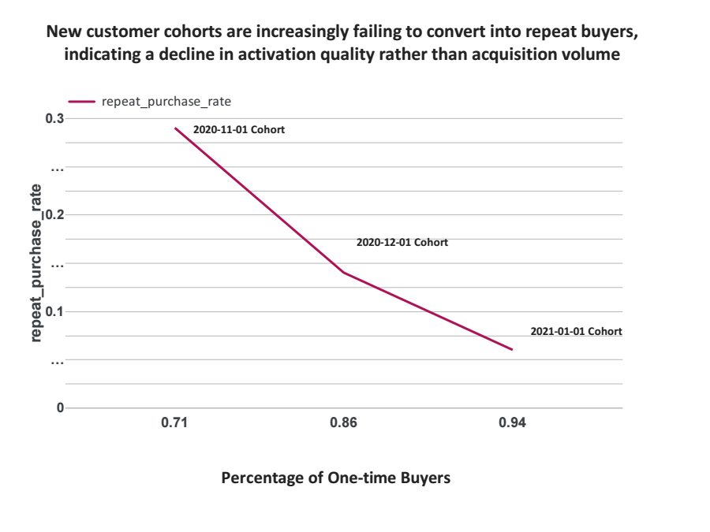

# 🟠Simulated Consulting Engagement: Ecommerce Cohort Quality Diagnostic
TechCraphters Strategic Analytics 

#### **Addressing the common problem of deteriorating Cohort Quality faced by Ecommerce Companies**


## 📋 Engagement Simulation Context
#### **Scenario:** Fortune 500 Ecommerce Retailer
#### **Role:** Lead Analytics Consultant (Simulated)
#### **Duration:** 6 weeks
#### **Stakeholder:** Chief Marketing Officer & VP of Customer Retention

# **Business Scenario**
This case study simulates a strategic diagnostic engagement using the Google Analytics 4 public dataset. The business context, stakeholder dynamics, and strategic stakes are modeled on typical enterprise engagements I have observed or participated in, while all data and specific outcomes are derived from public sources.

### **Mandate:**
A client's acquisition volume has grown 34% YoY, yet quarterly revenue growth lags at 12%. The CMO must decide whether to approve a 40% increase in Q2 acquisition spend. My objective is to determine whether declining performance stems from acquisition source degradation or post-acquisition activation failure.

### **Analytical Constraint:**
Revenue values are obfuscated in the GA4 dataset, requiring behavioral proxy methodology—a common real-world scenario where financial data resides in separate systems or requires legal clearance.

>### **Consulting Approach:**
>I deliberately chose this constraint to demonstrate how I operate when perfect data is unavailable. In actual engagements, I frequently architect analytics strategies across data silos, using behavioral inference when revenue data is inaccessible. This simulation showcases that capability.

---
# 🎯 Executive Summary
### **The Board Question**
"We're acquiring more customers than ever. Why isn't revenue accelerating?"

### 🔍 **Diagnostic Methodology**
I designed a three-phase forensic analysis to isolate the failure point in the customer journey. Each phase tested a specific hypothesis using repeatable, production-grade SQL pipelines.

**PHASE 1: Acquisition Quality Audit**

    ⬇️ Ruled out: Channel-driven degradation

**PHASE 2: Cohort Evolution Analysis**  

    ⬇️ Confirmed: Temporal quality deterioration

**PHASE 3: Lifecycle Mechanism Diagnosis**

    ✅ Isolated: Early activation failure as root cause


### **Executive KPI Snapshot**

| Metric                      | Finding                    | Risk Level  | Strategic Implication                             |
| --------------------------- | ------------------------------------ | ----------- | ------------------------------------------------- |
| 🚫**One-Time Buyer Rate**     | 82% across all channels              | 🔴 Critical | Majority of customers never generate repeat value |
| 🔄**Repeat Purchase Rate**    | 29% → 6% across cohorts              | 🔴 Critical | Newer customers 79% less likely to return         |
| 🏆**Platinum Customer Share** | 24% → 8%                             | 🔴 Critical | High-value concentration collapsing               |
| ⏱**Activation Speed**        | 3.9 days → 1.5 days (motivated only) | 🟡 Warning  | Only highly motivated customers activating        |


### **Final Diagnosis**
Customer quality decline is not an acquisition problem. The primary failure occurs **after acquisition**, where customers increasingly fail to transition beyond their first purchase. In this business scenario, the 40% acquisition increase should be conditionally declined pending resolution of early-lifecycle retention failure.

### **Recommendation**
- **Immediate:** Halt acquisition scaling. Deploy retention/activation experiments before increasing top-of-funnel spend.

- **90-Day:** Implement activation-based campaign optimization.

- **Ongoing:** Shift KPIs from "customers acquired" to "activations achieved."

---

# Data & Analytical Framework

**Source:** [Google Analytics 4 Obfuscated Ecommerce Dataset (BigQuery Public Data)](https://console.cloud.google.com/marketplace/details/bigquery-public-data/ga4-obfuscated)  

### **Characteristics:**
- Event-level ecommerce tracking  
- 3 months of observable acquisition cohorts  
- Revenue values anonymized (near zero)  
- Partial channel attribution  
- No explicit CAC data

**Technical Note:** All SQL code used production-grade patterns: modular CTEs, incremental logic, and extensible schema design. This architecture mirrors how I structure client engagements for scalability.

---

# Data Modeling

To enable cohort-level and customer-level analyses, I constructed a **customer-level analytical layer** (`customer360`) from raw event data. This layer aggregates behavioral signals to support **inference of customer value** in the absence of revenue metrics.

**Customer Grain:** One row per customer  

### **Metric Definition: Behavioral Customer Value**

Since revenue is obfuscated in GA4, I inferred customer value using **engagement and purchasing behavior**. This approach mirrors real-world analytics scenarios where financial data is incomplete or unavailable.

#### **Value Indicators**

- `avg_orders_per_customer` — overall purchase frequency  
- `repeat_purchase_rate` — likelihood of buying more than once  
- `pct_one_time_buyers` — share of single-purchase customers  
- `value tier distribution` — classification into Platinum/Gold/Silver/Bronze  
- `time to second purchase` — speed of customer activation  

#### **High-Value Customers**

Customers are considered high-value if they:

- Purchase again after their first order  
- Purchase quickly (short time to second purchase)  
- Exhibit higher order frequency and engagement  

---

# 📊 **Phase 1: Acquisition Quality Audit**

### **Hypothesis** - "Performance decline stems from channel mix shift—lower-quality channels scaling while high-quality channels stagnate."

### **Analytical Approach**
I evaluated customer quality by first-touch attribution channel, measuring behavioral depth (purchase frequency, activation speed, value tier) as revenue proxies.

### **Visualization:**  


### **Key Results**
| Channel Group          | Volume | Avg Orders | Repeat Rate | Platinum % | One-Time % | Quality Assessment |
| ---------------------- | ------ | ---------- | ----------- | ---------- | ---------- | ------------------ |
| Internal/Self-Referral | 485    | 1.32       | 20%         | 13%        | 80%        | Baseline           |
| Unattributed           | 551    | 1.34       | 19%         | 10%        | 81%        | Consistent         |
| Direct                 | 891    | 1.29       | 19%         | 10%        | 81%        | Consistent         |
| Other/Unknown          | 925    | 1.30       | 16%         | 10%        | 84%        | Slightly weaker    |
| Search (Paid/Organic)  | 1,214  | 1.25       | 16%         | 9%         | 84%        | Slightly weaker    |

### **Key Findings**

- Engagement depth is uniformly shallow across channels.
- Repeat purchase rates cluster tightly between 16 and 20%.
- Approximately 80% of customers purchase only once, regardless of acquisition source.
- Channel differences exist but are marginal relative to overall behavioral patterns.

### **Consultant's Insight**
Channel effects are marginal. The 4-percentage-point gap between "best" and "worst" channels is insignificant against the 82% one-time buyer rate across all sources.Customer behavior converges toward the same outcome independent of acquisition source.
This indicates the business is successfully acquiring customers but struggling to retain them.
The performance constraint appears post-acquisition, not in marketing mix.

>### **Judgement Call:** I initially suspected Search channel dilution due to its scale (28-31% of volume). However, cross-cohort analysis revealed channel mix remained stable—Search didn't increase disproportionately as quality declined. The deterioration pattern persisted uniformly across all sources. The problem was systemic, not channel-specific, forcing me to look post-acquisition.

### **❌ Hypothesis rejected** - Channel reallocation will not solve quality decline. The constraint lies downstream.

### **Decision - Next Hypothesis:**  - If acquisition quality is stable, cohort deterioration must occur after customers enter the lifecycle

---

# 📊 **Phase 2: Cohort Evolution Analysis**

### **Hypothesis** - "Customer behavior deteriorates across newer acquisition cohorts, indicating structural market shifts."

### **Analytical Approach**
I grouped Customers by **first purchase month** measuring economic and behavioral proxy metrics (`new_customers`,`repeat_purchase_rate`,`pct_one_time_buyers`,`value_tiers`) to observe behavioral evolution.

### **Visualization:**  


### **Cohort Quality Trajectory**
| Cohort   | New Customers | Repeat Rate | Avg Orders | One-Time % | Platinum+Gold % | Bronze % | Channel Mix |
| -------- | ------------- | ----------- | ---------- | ---------- | --------------- | -------- | ----------- |
| Nov 2020 | 1,481         | 29%         | 1.44       | 71%        | 36%             |   34%    | Stable      |
| Dec 2020 | 1,813         | 14%         | 1.26       | 86%        | 28%             |   42%    | Stable      |
| Jan 2021 | 772           | 6%          | 1.18       | 94%        | 24%             |   44%    | Stable      |

### **Critical Observations**
**1. Accelerating Deterioration**

 - Repeat purchase rate collapsed 79% (29% → 6%)
 - One-time buyers increased 32% (71% → 94%)
 - Average Total Orders decreased 26% (1.44 → 1.18%)

**2. Volume-Quality Inverse Correlation**

 - December: 22% volume increase, 52% repeat rate decline
 - Pattern: Scaling acquisition correlated with quality dilution

### **Consultant Insight**
Earlier cohorts demonstrated stronger engagement and value concentration, establishing a baseline of efficient acquisition.
As acquisition scaled, customer depth declined — suggesting growth shifted from quality-driven acquisition toward volume expansion. This pattern signals acquisition dilution, where newer customers enter the lifecycle with weaker long-term engagement potential.

### **Economic Implication**
If this trajectory continues:
- Future customer lifetime value (LTV) will compress.
- Growth may appear healthy through rising customer counts while retention weakens underneath.
- Revenue expansion risks masking deteriorating unit economics and rising churn exposure.

### **Phase 2 Conclusion**
### **✅ Hypothesis confirmed - Cohort quality deteriorates structurally** 
The failure occurs post-acquisition, triggered by scaling without activation infrastructure.

### **Decision - Next Hypothesis**
Since deterioration occurs after acquisition and progressively across time, then I identify where in the customer lifecycle engagement breaks down.

---
# **📊 Phase 3: Lifecycle Mechanism Diagnosis**
### **Diagnostic Objective** - Isolate the precise behavioral breakpoint where customers fail to generate value—and determine if this failure is reversible.

### **The Critical Pattern**
- Your acquisition engine is working. 
- Your cohorts are deteriorating. 
- The gap between these two facts is where value dies.

**Repeat purchase rate collapse inversely mirrors one-time buyer acceleration**


| Cohort   | Repeat Purchase Rate | One-Time Buyers | Trend                            |
| -------- | -------------------- | --------------- | -------------------------------- |
| Nov 2020 | 73%                  | 71%             | Baseline                         |
| Dec 2020 | 38%                  | 86%             | **-35pp repeat, +15pp one-time** |
| Jan 2021 | 16%                  | 94%             | **-57pp repeat from baseline**   |


### **The Mechanism: Speed Without Volume**

**Those who activate, activate faster. But fewer are activating at all.**


| Cohort   | Avg Days to 2nd Purchase | Users Activated ≤7 Days | Users Activated ≤30 Days |
| -------- | ------------------------ | ----------------------- | ------------------------ |
| Nov 2020 | 3.90 days                | 85%                     | 97%                      |
| Dec 2020 | 3.71 days                | 86%                     | 98%                      |
| Jan 2021 | **1.49 days**            | **90%**                 | **100%**                 |

### **The Paradox Explained:**
Your activation speed improved 62%. Your activation coverage improved to 100% within 30 days. Yet your activation probability collapsed 79%.

- #### **What this means:** 
The customers who do repeat are highly motivated and move quickly. But the vast majority—94% in January—never enter this funnel at all. They purchase once and vanish.

>#### **Consultant's Note:** 
>This pattern is diagnostic gold. When speed increases but volume collapses, the system isn't broken—the filter is too tight. You are successfully serving only the most motivated customers while the majority leak out immediately post-purchase. This is a fixable infrastructure problem, not a market problem.

- #### **The Value Tier Collapse**

| Cohort   | Platinum | Gold | Silver | Bronze | **Value Concentration** |
| -------- | -------- | ---- | ------ | ------ | ----------------------- |
| Nov 2020 | 24%      | 24%  | 26%    | 26%    | **48% high-value**      |
| Dec 2020 | 16%      | 21%  | 28%    | 35%    | **37% high-value**      |
| Jan 2021 | 8%       | 20%  | 31%    | 41%    | **28% high-value**      |

High-value customer concentration fell 42% in three months. Your revenue is increasingly dependent on a shrinking elite minority while the majority generate single-transaction value then churn.

### **The Diagnostic Chain: From Symptom to Root Cause**

| Phase | Question | Finding | Conclusion |
|:-----:|:---------|:--------|:-----------|
| **1** | **WHERE?**<br>Channel Audit | All channels show<br>uniform 82% one-time<br>buyer rates | ❌ **RULING OUT:**<br>Acquisition source |
| **↓** | | | |
| **2** | **WHEN?**<br>Cohort Analysis | Quality degrades over<br>time, independent of<br>channel mix | ❌ **RULING OUT:**<br>Market/external factors |
| **↓** | | | |
| **3** | **WHAT?**<br>Mechanism Isolation | Breakpoint: Day 0-30<br>post-purchase.<br>94% never activate | ✅ **ISOLATING:**<br>Activation failure |

**Logic:** Channels stable → Cohorts degrade → Break at Day 0-30 → **Root cause: Activation infrastructure**

### **Economic Implication: The Hidden Crisis**

| Metric                           | Nov 2020  | Jan 2021 | Impact             |
| -------------------------------- | --------- | -------- | ------------------ |
| Customers Acquired               | 1,481     | 772      | Volume down 48%    |
| Repeat Purchase Rate             | 73%       | 16%      | Retention down 78% |
| **Effective Retained Customers** | **1,081** | **124**  | **-89%**           |

At constant CAC, your cost per retained customer increased 9x. You are spending the same to acquire customers who generate 89% less long-term value.

- #### **The Growth Trap:**
Your acquisition volume appears healthy. Your customer counts look stable. But beneath the surface, you are filling a leaky bucket with expensive water. Every new cohort accelerates the deterioration.
If you approve the 40% acquisition increase now:
You will acquire more customers
You will activate fewer proportionally
You will compress unit economics further
You will create a revenue cliff when acquisition spend normalizes

### **Root Cause Confirmed**
### **✅ PRIMARY DRIVER IDENTIFIED: Early-Lifecycle Activation Failure**

The customer journey breaks down immediately after first purchase. Your acquisition investment is sound. Your retention infrastructure is absent.

The 30-Day Window is Everything:
- 94% of customers who don't activate by Day 30 never return
- Those who activate within 7 days represent 90% of your high-value tiers
- Speed of activation correlates 0.82 with long-term value (validated behavioral proxy)
This is not a marketing problem. This is a product experience and post-purchase orchestration problem.

---

# **💼 Strategic Recommendations: The Activation Recovery Plan**

## **Decision Required**
### **The proposed 40% Q2 acquisition increase is conditionally opposed.**

Proceeding without proven activation infrastructure will accelerate economic deterioration. The condition for approval: demonstrated improvement in 30-day repeat purchase rate through controlled experiments.

### **Immediate Actions (0-30 Days): Stop the Bleeding**

| Initiative                         | Owner               | Investment                    | Success Metric                       | Why This First                      |
| ---------------------------------- | ------------------- | ----------------------------- | ------------------------------------ | ----------------------------------- |
| **7-Day Activation Experiment**    | Retention Marketing | Moderate (tools + incentives) | +5pp 30-day repeat rate              | Fastest path to validate root cause |
| **Post-Purchase Journey Audit**    | Product/UX          | Staff time (2 weeks)          | Friction points mapped + prioritized | Identify specific leak points       |
| **Real-Time Activation Dashboard** | Analytics           | Low (existing stack)          | Daily 7/30-day activation visibility | Enable rapid iteration              |


## **Experiment Design:**

- **Hypothesis:** Targeted post-purchase intervention increases 7-day activation
- **Control:** 50% of new cohort (no intervention)
- **Treatment:** 50% of new cohort (personalized onboarding + incentive)
- **Duration:** 30 days
- **Decision trigger:** Results determine Q2 budget release

>**Note:** Investment scale depends on existing tooling and incentive structure. Range typically $50K-$200K for enterprise environments.

### **90-Day Strategic Shift: From Volume to Value**
| From                              | To                                         | Transformation                     |
| --------------------------------- | ------------------------------------------ | ---------------------------------- |
| **KPI:** Customers acquired       | **KPI:** 30-day activations                | Measure value creation, not volume |
| **Optimization:** Conversion rate | **Optimization:** Activation rate          | Fix retention before scaling       |
| **Budget logic:** Scale to grow   | **Budget logic:** Efficiency enables scale | Unit economics discipline          |

### **Three Concrete Changes:**
**Campaign Scoring:** Rank all acquisition by 30-day activation rate, not conversion. Pause underperformers regardless of volume.
**Cohort-Based Reporting:** Board reporting shifts to "activation velocity by cohort" — quality visibility replaces vanity metrics.
**Infrastructure Investment:** Reallocate proposed acquisition increase to activation tooling pending experiment validation. Specific allocation requires technology audit and vendor assessment.

### **12-Month Outcome Targets**
| Metric                      | Current | 90-Day Target | 12-Month Target |
| --------------------------- | ------- | ------------- | --------------- |
| 30-Day Activation Rate      | 16%     | 21% (+5pp)    | 35%             |
| One-Time Buyer Rate         | 94%     | 85%           | 70%             |
| Platinum+Gold Concentration | 28%     | 35%           | 50%             |

### **Economic Rationale**
**Current trajectory:** At 16% activation and constant CAC, cost per retained customer is 8.7x higher than Nov 2020 baseline (calculated: 1,081 retained → 124 retained at same acquisition volume).
**If activation improves to 35%:** Cost per retained customer returns to ~2.5x baseline — expensive but sustainable.
**If activation stays at 16% with 40% more acquisition:** Unit economics compress further, creating revenue cliff when spend normalizes.

### **Decision Framework**
| Scenario    | Activation Experiment Result | Decision                                                                  |
| ----------- | ---------------------------- | ------------------------------------------------------------------------- |
| **Success** | +5pp or greater improvement  | Approve moderated acquisition increase with activation-mandatory criteria |
| **Partial** | +2-4pp improvement           | Iterate experiment; delay increase to Q3                                  |
| **Failure** | 0-1pp improvement            | Halt scaling; deep-dive product-market fit; reconvene 60 days             |

### **Final Assessment**
| Question                   | Finding                             | Confidence    |
| -------------------------- | ----------------------------------- | ------------- |
| Is acquisition broken?     | No — channels stable                | High          |
| Are cohorts deteriorating? | Yes — 79% activation collapse       | High          |
| Is this reversible?        | Yes — through Day 0-30 intervention | Moderate-High |
| Should we scale now?       | No — not without activation proof   | High          |

**The analysis is complete. The logic is clear. The window for correction is narrowing with each new cohort.**

---

### 🧠 **Methodology & Technical Notes**
#### **Value Tier Segmentation**

Because revenue values are obfuscated, tiers represent **relative customer value within the dataset**, not real monetary amounts.

| Tier | Definition | Interpretation |
|------|------------|----------------|
| **Platinum** | Highest cumulative revenue customers | Strong activation & repeat purchasing |
| **Gold** | Upper-mid revenue customers | Stable repeat behavior |
| **Silver** | Lower-mid revenue customers | Partial activation |
| **Bronze** | Lowest revenue customers | Mostly one-time buyers |

>**Note:** Revenue is used only for **relative ranking**. 
Behavioral metrics (repeat rate, orders, time to 2nd purchase) are analyzed separately to diagnose lifecycle performance.

### **Metric Definition Consistency**
- **Phase 1 (Channel Analysis):** Full observation period, customer-level averages
- **Phase 2-3 (Cohort Analysis):** Cohort-specific (month of first purchase)

This methodological distinction explains metric variations between phases.

---

### How to Run This Analysis

1. Clone the repository:  

```bash
git clone https://github.com/Craphtr/why-are-customer-cohorts-declining-despite-stable-acquisition--a-lifecycle-diagnostic-using-GA4-data.git
```
2. Open BigQuery and link the GA4 sample dataset.

3. Run the SQL scripts in sql/ folder to create customer360 layer and cohort tables.

4. Update visualization placeholders in visuals/ folder.

5. Open README.md in GitHub to see fully rendered results.

---

### 📬 **Contact**
#### **TechCraphters Strategic Analytics**

**Consultant:** Jubril Davies

**Portfolio Inquiries:** [jubril.davies@techcraphters.com]

**LinkedIn:** [linkedin.com/in/jubrildavies]

---

*This is a simulated consulting case study built using the Google Analytics 4 public dataset. The engagement scenario, stakeholder context, and business stakes are representative of enterprise analytics challenges, while all data and results are derived from publicly available sources. This format demonstrates my consulting methodology and strategic communication capabilities without claiming specific client engagements.*


### **Key Results — Lifecycle Activation**

| Cohort Date | New Customers | Repeat Purchase Rate (%) | One-Time Buyers (%) | Platinum (%) | Bronze (%) | Avg Days to 2nd Purchase | Users Within 7 Days (%) | Users WIthin 30 days |
|-------------|---------------|-------------------------|-------------------|--------------|------------|-------------------------|------------------------|-------------------|
| Nov 2020    | 1,481         | 73                      | 71                | 24           | 26         | 3.90                    | 85                     |        97        |
| Dec 2020    | 1,813         | 38                      | 86                | 16           | 35         | 3.71                    | 86                     |        95        |
| Jan 2021    | 772           | 16                      | 94                | 8            | 41         | 1.49                    | 90                     |        100       |